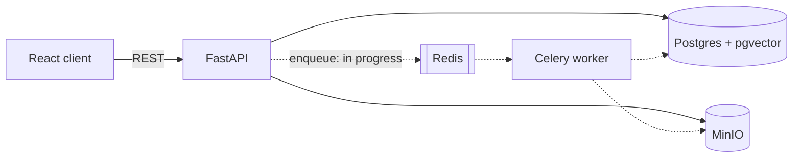

# Closet AI

A digital wardrobe that turns phone photos of your clothes into a clean, searchable closet. Upload a photo of any garment and the CV pipeline hands back a catalog-style image — background removed, cropped, and normalized — stored alongside structured wardrobe data.

<!-- TODO(michelle): add screenshot or short GIF of the upload flow here -->

## What works today

- **Image processing pipeline** — the core of the project. Each upload goes through:
  1. Background removal with **rembg** (U2Net)
  2. Alpha-aware crop to the garment's tight bounding box
  3. Bilateral filtering to soften fabric wrinkles
  4. Aspect-preserving resize onto a padded 512×512 canvas, composited to white, encoded as PNG
- **Wardrobe API** — full CRUD over clothing items (FastAPI + SQLAlchemy + Pydantic), with processed images in MinIO object storage
- **Auth** — JWT register/login guarding all wardrobe routes
- **Web client** — React 18 + TypeScript (Vite, Tailwind, React Query)
- **One-command dev environment** — Docker Compose runs the API, Postgres (pgvector), Redis, MinIO, and a bucket bootstrapper

## In progress

- **Async processing** — image processing currently runs in the request path; moving it onto the Celery worker (already provisioned in compose) so uploads return immediately
- **Visual similarity search** — Gemini image embeddings (768-dim) stored in pgvector; the `ClothingEmbedding` model and status tracking are in, generation and search endpoints are next
- **LLM metadata extraction** — auto-tagging category/color/name from the processed image

## Architecture



## Why these choices

- **FastAPI** — async-first with Pydantic validation and free OpenAPI docs at `/docs`; the API layer stays thin and typed.
- **MinIO** — speaks the S3 API, so local dev needs no cloud account and a production swap to real S3 is a config change, not a code change.
- **pgvector** — similarity search inside Postgres instead of a separate vector database: one system to run, and embeddings live in the same transaction boundary as the rows they describe.
- **Celery + Redis** — background removal is CPU-bound and takes seconds; that work belongs on a worker, not inside an HTTP request.
- **rembg (U2Net)** — runs locally and free; no per-image API costs while iterating on the pipeline.

## Running it

Requires Docker and Node 18+.

```bash
cp .env.example .env        # defaults work for local dev
docker compose up --build   # API on :8000, MinIO console on :9001
cd client && npm install && npm run dev   # client on :5173
```

Interactive API docs: http://localhost:8000/docs

## Tests

Backend tests live in `server/tests` (auth, wardrobe, embedding model) and run under pytest against a disposable Postgres from the compose `test` profile.
